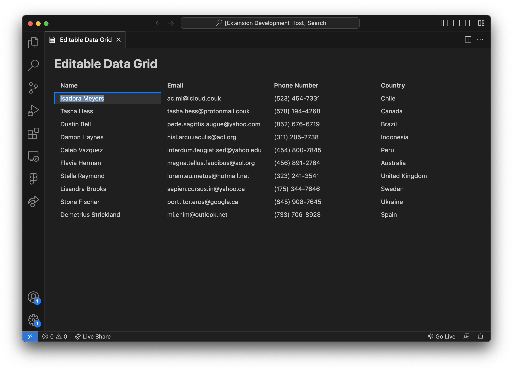

# Editable Data Grid Sample Extension

This is a sample extension that demonstrates a reference/workaround
implementation for making the `vscode-data-grid` component editable.



## Context

> **Warning**<br> This is not a fully tested (nor first-party) editable data
> grid. Proceed with caution.

There have been many requests (such as
[this issue](https://github.com/microsoft/vscode-webview-ui-toolkit/issues/493))
asking for a more interactive data grid.

The Webview UI Toolkit is implemented using a set of unstyled based components
from [FAST](https://www.fast.design/). They offer a `data-grid` component which,
at this time, statically renders data in a table-like format but does not
implement any APIs for interactivity or editability.

Because FAST owns the underlying data grid implementation, first-party support
for interactivity will need to come from them. With that said, workaround
solutions are possible and this sample extension demonstrates one such solution
(initially inspired by
[another solution](https://github.com/microsoft/vscode-webview-ui-toolkit/issues/493#issuecomment-1603559439)
from [@worksofliam](https://github.com/worksofliam)).

Issues and improvements to this solution are welcomed and encouraged!

## Features

This solution implements the following features:

-   Editable data grid cells using the `contenteditble` attribute
-   Keyboard shortcuts to enter/exit edit mode
    -   `Enter`: Will toggle between edit modes when focused on a given cell
    -   `Escape`: Will exit edit mode when focused on a given cell
-   Mouse click and blur will enter/exit edit mode
-   Cell text will be automatically highlighted when entering edit mode
-   Cell changes will be synced with the underlying `vscode-data-grid` data
    structure

## Known issues

-   Arrow keys don't work in edit mode

## Run The Sample

```bash
# Copy sample extension locally
npx degit microsoft/vscode-webview-ui-toolkit-samples/default/editable-data-grid editable-data-grid

# Navigate into sample directory
cd editable-data-grid

# Install sample dependencies
npm install

# Open sample in VS Code
code .
```

Once the sample is open inside VS Code you can run the extension by doing the
following:

1. Press `F5` to open a new Extension Development Host window
2. Inside the host window, open the command palette (`Ctrl+Shift+P` or
   `Cmd+Shift+P` on Mac) and type `Editable Data Grid: Show`
